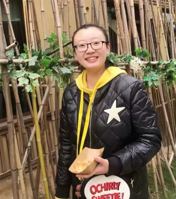

#  **
Tiantian CHEN
**

***

🏫No.37 Xueyuan Road, Haidian District, Beijing, P.R. China, 100191　　　　　　　　　　　　　　　　　　　　　　　　　　　　　　　　　　　　　　　　　📞+8618334549775　📧<chen123@buaa.edu.cn>

***

## **Education**
**Beihang University (BUAA)**　　　　　　　　　　　　　　　　　　　　　　　　　　Beijing, China
  Candidate for the Master’s degree in fluid mechanics　　　　　　　　    　　　　&ensp;09/2019 - Present
- Overall grade: 91.58/100 ranked 3/46
- Second-class scholarship (2019 and 2020)

**Technische Universität Braunschweig (TUBS)**　　　　　　　　　　　　Braunschweig, Germany
Outstanding Undergraduate International Exchange Program funded by China Scholarship Council (CSC) - for undergraduation thesis　　　　　　　　　　　　　　　　　　　&ensp;&ensp;&ensp;&ensp;&ensp;01/2019 - 07/2019　　　　   　　　　　　　　　　　　　　　　　 　　　　　　　　　　　　　　　　　　　　　　　　　　　　　　　　　　　　　　　　　　　　　　　　　　　　　　　　　

**Northwestern Polytechnical University (NPU)**　　　　　　　　　　　　　　　　　Xi’an, China
*B.Eng.*&ensp;in Aircraft design and engineering　　　　　　　　　　　　　　　　   &ensp;&ensp;　09/2015 - 07/2019
- Overall grade: 91.09/100 ranked 5/250
- First-class scholarship (2016)
- Second-class scholarship (2015, 2017 and 2018)

***

## **Research**
**Postgraduate Stage**

- Studying in the bionic fluid mechanics laboratory in Professor Mao Sun’s group,　　　　　　　　　　　　　　　　　　　　　　　　　　　　and mainly focusing on:

　　1. The aerodynamics of maple and ash samaras　　　　　　　　　　　　　　　　　　　　　　　　　　　　　　　　　　　　　　　　　　　　　　　　　　　　　　　　　　　　　　　　　　　　　　　　&ensp;&ensp;&ensp;&ensp;2. The dynamic stability of maple samaras

- Further taking a series of courses in fluid mechanics including advanced fluid mechanics, computational fluid mechanics and various related experiments.  

**Undergraduate Stage**

- Have systematically studied aeronautics including fluid mechanics,  solid mechanics and flight dynamics, and attended varied theoretical and experimental courses.

- Participated in the scientific research training project, using Python to do the identification of the aircraft system.

- Conducted my graduation project in TUBS:　'Central loading experiments on cracking of glass surface bonded to an aluminum substrate'.

***

## **Activity and Skills**
**Activity**
-	Volunteered for the orientation event in the first semester of the second year of postgraduate.

**Skills**

-	Language: Chinese (native), English (TOEFL: 103), German (basic).

-	Software: 

　　1. Basic software: proficient in MS Office, C++ and MATLAB; Python (used before).　　　　　　　　　　　　　　　　　　　　　　　　　　　　　　　　　　　　　　　　　　　　　　　　　　　　　　　　　　　　　　　　　　　　　　　　　　　　　　　&ensp;&ensp;&ensp;&ensp;2. Professional software: CATIA, ICEM, Pointwise, Fluent, and other necessary research tools.

-	Interest: traveling, swimming and reading.

***

## **Publications**
-	Dynamic Flight Stability in Free-falling Maple Seeds.
